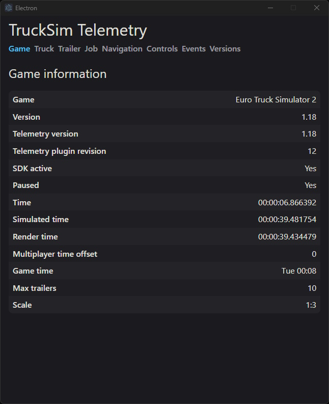

# TruckSim-Telemetry-Demo
A demo app for [TruckSim-Telemetry](https://github.com/kniffen/TruckSim-Telemetry)

## Download
You can download the windows executable [HERE](https://github.com/kniffen/TruckSim-Telemetry-Demo/releases)

## Screenshot


## Setup

### Prerequisites
- Node.js (v24 or higher)
- pnpm (v11 or higher)

### Installing pnpm
If you don't have pnpm installed, you can install it using one of the following methods:

```bash
npm install -g pnpm
```

### Installation
1. Clone the repository:
   ```bash
   git clone https://github.com/kniffen/TruckSim-Telemetry-Demo.git
   cd TruckSim-Telemetry-Demo
   ```

2. Install dependencies:
   ```bash
   pnpm install
   ```

### Development
Run the app in development mode:
```bash
pnpm dev
```

### Building
Build the application for your platform:

**Windows:**
```bash
pnpm build:win
```


